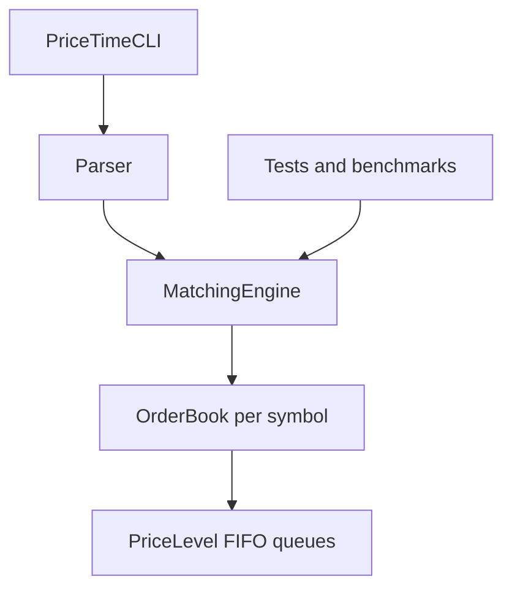

# PriceTime

PriceTime is a C++20 limit order book and matching engine that applies price-time priority. It models the core behaviour of an electronic exchange: accepting limit orders, matching crossing orders, preserving FIFO priority at each price, cancelling and modifying resting orders, and reporting market depth.

The project is structured as a reusable static library with separate command-line, test, and benchmark applications. It was built as a portfolio project for low-latency C++, trading-systems, and quantitative-development roles.

## Project status

Version 1.0 is feature-complete. The engine, CLI, unit-test suite, and benchmark suite are implemented and working in Visual Studio using `Release | x64`.

## Features

- Price-time-priority limit-order matching
- FIFO ordering within each price level
- Buy and sell limit orders
- Partial and multi-order fills
- Matching across multiple price levels
- Order cancellation through an ID lookup index
- Order modification through cancel-and-resubmit semantics
- Best bid, best ask, spread, and configurable market depth
- Independent books for multiple symbols
- Integer-tick prices to avoid floating-point price errors
- Interactive command-line interface
- Automated GoogleTest coverage
- Google Benchmark performance scenarios

## Architecture



The main data structures are:

| Component | Responsibility |
|---|---|
| `Order` | Stores an order's ID, side, price, quantities, and sequence number |
| `PriceLevel` | Maintains the FIFO queue and aggregate quantity at one price |
| `OrderBook` | Holds sorted bid/ask levels, matches orders, and maintains the ID index |
| `MatchingEngine` | Owns an independent `OrderBook` for each symbol |
| `Parser` | Converts CLI text into strongly typed commands |
| `Trade` | Represents an execution between a maker and taker order |

Price levels are stored in ordered maps, orders at a price are stored in linked FIFO lists, and an unordered ID index points directly to resting orders for efficient cancellation.

### Container choices

`std::map` was selected for sorted, potentially sparse price levels. `std::list` provides FIFO ordering and stable iterators. The unordered order-ID index provides average constant-time lookup, after which removing an order from an existing list is constant time. If a cancellation empties a price level, removing that level from the ordered map is `O(log P)`, where `P` is the number of active price levels.

This version prioritises correctness and clarity. A production-oriented variant could use bounded tick-indexed levels, intrusive queues, and preallocated order storage after profiling. Tick-indexed storage can improve locality, but its memory use grows with the represented price range; sparse or wide-range instruments may require a windowed layout or a map-based fallback.

## Solution structure

```text
PriceTime/
├── PriceTimeEngine/       Reusable static library
├── PriceTimeCLI/          Interactive console application
├── PriceTimeTests/        GoogleTest unit tests
├── PriceTimeBenchmarks/   Google Benchmark scenarios
└── PriceTime.slnx         Visual Studio solution
```

## CLI commands

Prices use integer ticks. For example, `1050` represents `10.50` when one tick is one penny.

| Command | Purpose | Example |
|---|---|---|
| `ADD` | Submit a new limit order | `ADD AAPL 1 BUY 1050 100` |
| `CANCEL` | Cancel a resting order | `CANCEL AAPL 1` |
| `MODIFY` | Replace an order at a new price and quantity | `MODIFY AAPL 1 1060 80` |
| `BOOK` | Display a number of depth levels | `BOOK AAPL 5` |
| `QUIT` | Close the CLI | `QUIT` |

Example session:

```text
ADD AAPL 1 BUY 1050 100
ADD AAPL 2 SELL 1060 50
BOOK AAPL 5
ADD AAPL 3 BUY 1060 30
BOOK AAPL 5
CANCEL AAPL 1
QUIT
```

## Requirements

- Windows 10 or later
- Visual Studio with MSBuild 17.13 or later and the **Desktop development with C++** workload
- MSVC with C++20 support
- x64 build tools
- vcpkg manifest integration for Google Benchmark

The benchmark project uses the `x64-windows-static` vcpkg triplet. Release builds use the static multithreaded runtime (`/MT`), while Debug builds use `/MTd`.

## Build and run

1. Clone the repository and open `PriceTime.slnx` in Visual Studio.
2. Select `Release` and `x64` on the top toolbar.
3. Choose **Build > Rebuild Solution**.
4. Set `PriceTimeCLI` as the startup project.
5. Run without debugging using `Ctrl+F5`.

The CLI can also be launched from the solution directory:

```powershell
.\x64\Release\PriceTimeCLI.exe
```

## Tests

The project contains **45 unit tests**, covering validation, FIFO behaviour, matching, cancellation, modification, symbol isolation, and parsing.

| Test group | Tests |
|---|---:|
| Order | 5 |
| PriceLevel | 8 |
| OrderBook | 11 |
| MatchingEngine | 7 |
| Parser | 14 |
| **Total** | **45** |

Run the suite using Visual Studio's **Test Explorer**, or execute:

```powershell
.\x64\Release\PriceTimeTests.exe
```

## Benchmarks

Benchmarks were compiled with optimisations enabled using `Release | x64`. The table reports medians from five repetitions on a machine reported by Google Benchmark as `8 x 3392 MHz CPU(s)`.

| Scenario | Median time | Median CPU time | Throughput |
|---|---:|---:|---:|
| Non-crossing insertion | 1,298 ns | 1,221 ns | 819.2K operations/s |
| Resting-order cancellation | 746 ns | 767 ns | 1.30M operations/s |
| Immediate one-to-one match | 859 ns | 893 ns | 1.12M operations/s |
| Sweep 1 ask level | 870 ns | 854 ns | 1.17M sweep orders/s |
| Sweep 5 ask levels | 2,357 ns | 2,288 ns | 437.1K sweep orders/s |
| Sweep 10 ask levels | 3,899 ns | 3,587 ns | 278.8K sweep orders/s |
| Sweep 50 ask levels | 26,756 ns | 25,670 ns | 39.0K sweep orders/s |
| Mixed 64-request workload | 11,952 ns | 11,998 ns | 5.33M requests/s |

### Benchmark interpretation

The isolated benchmarks repeatedly create or remove price levels and use paused setup phases, whereas the mixed workload processes a hot batch of 64 requests at an existing price level. Its per-request average therefore should not be compared directly with isolated-operation latency.

Run the repeated benchmark suite with:

```powershell
.\x64\Release\PriceTimeBenchmarks.exe --benchmark_repetitions=5 --benchmark_report_aggregates_only=true
```

These are synthetic single-threaded development benchmarks, not exchange-production latency guarantees. Results depend on the processor, compiler, build configuration, background activity, and benchmark methodology.

## Matching behaviour

- The highest bid and lowest ask have priority.
- At the same price, the earliest resting order matches first.
- Trades execute at the resting maker order's price.
- An unfilled incoming remainder rests in the book.
- A fully filled order is removed from both its price level and ID index.
- Version 1 implements every modification as cancellation followed by resubmission, so the order loses its previous time priority. A future venue-style implementation could reduce quantity in place while retaining priority, while price changes or quantity increases would requeue the order.
- Order IDs are scoped per symbol because each `OrderBook` owns its own ID index. The same numeric ID may therefore exist simultaneously in different symbol books.

## Current scope and roadmap

Version 1 deliberately focuses on a correct, testable matching-engine core. Planned extensions are prioritised as follows.

### Near-term engineering work

- Add a cross-platform CMake build with Linux support using GCC and Clang.
- Add GitHub Actions builds and tests for Windows and Linux, including AddressSanitizer and UndefinedBehaviorSanitizer checks on Linux.
- Redesign isolated benchmarks around warmed, batched operations so setup and timer-control overhead are amortised consistently.
- Add a latency-distribution harness reporting p50, p99, and p99.9 on native Linux rather than treating aggregate benchmark medians as production tail latency.
- Add generated order-flow tests that validate book invariants after every operation, including uncrossed books, aggregate-quantity consistency, index size, and conservation of traded quantity.
- Refine modification semantics so eligible quantity reductions retain queue priority.

### Longer-term exchange features and optimisation

- Add participant or account identifiers with configurable self-trade prevention.
- Add market, IOC, FOK, and post-only order types.
- Add persistent event logging, deterministic replay, and recovery tests.
- Separate a deterministic single-writer matching core from multithreaded order-ingress and market-data components.
- Add a network protocol or REST/WebSocket gateway.
- Compare the current sparse map/list design with allocation-aware containers, object pools, intrusive queues, and bounded tick-indexed price levels.
- Use native Linux profiling tools such as `perf` to guide changes using cache misses, branch misses, and instructions-per-cycle measurements.

## License

This project is licensed under the MIT License. See `LICENSE` for details.
